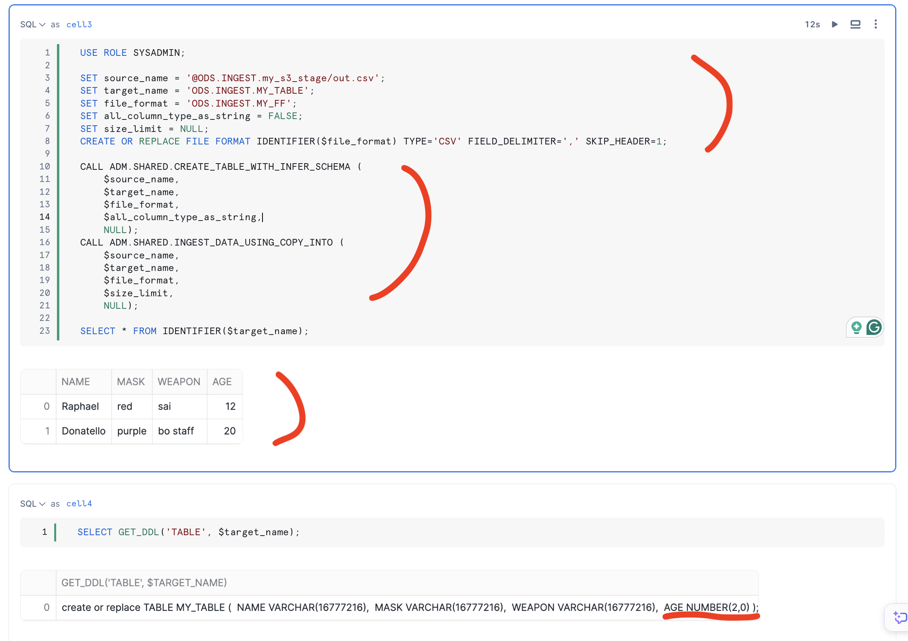
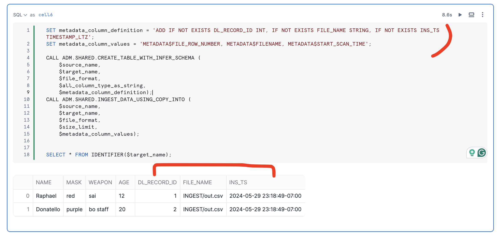

One thing I learned from my work is that even though having proper table definition is good for the data standardization, sometimes we just want to have the data be ingested to Snowflake without worrying about if all the column types are 100% correct or not. 

The following is the code I use for this case which can help me easily ingest data into snowflake with only 4 main required parameters, `SOURCE_NAME`, `TARGET_NAME`, `FILE_FORMAT`, and `ALL_COLUMN_TYPE_AS_STRING`. Sometimes, when the dataset is large, it can be time consuming on infering schema. If we just want to create a table from the dataset and do not care about the column type, then we can set `ALL_COLUMN_TYPE_AS_STRING` as TRUE. And, if we do not want to load all data and want to limit by size, then we can set `SIZE_LIMIT` as not null. 

```sql
SET source_name = '@ODS.INGEST.my_s3_stage/out.csv';
SET target_name = 'ODS.INGEST.MY_TABLE';
SET file_format = 'ODS.INGEST.MY_FF';
SET all_column_type_as_string = FALSE;
SET size_limit = NULL;
CREATE OR REPLACE FILE FORMAT IDENTIFIER($file_format) TYPE='CSV' FIELD_DELIMITER=',' SKIP_HEADER=1;

CALL ADM.SHARED.CREATE_TABLE_WITH_INFER_SCHEMA (
    $source_name, 
    $target_name, 
    $file_format, 
    $all_column_type_as_string,
    NULL);
CALL ADM.SHARED.INGEST_DATA_USING_COPY_INTO (
    $source_name, 
    $target_name, 
    $file_format, 
    $size_limit,
    NULL);

SELECT * FROM IDENTIFIER($target_name);
```




```sql
SET metadata_column_definition = 'ADD IF NOT EXISTS DL_RECORD_ID INT, IF NOT EXISTS FILE_NAME STRING, IF NOT EXISTS INS_TS TIMESTAMP_LTZ'; 
SET metadata_column_values = 'METADATA$FILE_ROW_NUMBER, METADATA$FILENAME, METADATA$START_SCAN_TIME';

CALL ADM.SHARED.CREATE_TABLE_WITH_INFER_SCHEMA (
    $source_name, 
    $target_name, 
    $file_format, 
    $all_column_type_as_string,
    $metadata_column_definition);
CALL ADM.SHARED.INGEST_DATA_USING_COPY_INTO (
    $source_name, 
    $target_name, 
    $file_format, 
    $metadata_column_values);

SELECT * FROM IDENTIFIER($target_name);
```



```sql
CREATE OR REPLACE PROCEDURE ADM.SHARED.CREATE_TABLE_WITH_INFER_SCHEMA (
    SOURCE_NAME STRING,
    TARGET_NAME STRING,
    FILE_FORMAT STRING,
    ALL_COLUMN_TYPE_AS_STRING BOOLEAN, -- FALSE, use infer schema to figure out the correct type, otherwise, all columns' type is STRING
    METADATA_COLUMN_DEFINITION STRING) -- NULL, if no columns needed to be added 
RETURNS TABLE()
LANGUAGE SQL
AS
DECLARE
    SQL_STATEMENT_CREATE_TABLE STRING;
    SQL_STATEMENT_ALTER_TABLE STRING;
    SQL_CREATE_FF_INFER STRING;
    SQL_ALTER_FF_INFER STRING;
    SQL_DROP_FF_INFER STRING;
    FILE_FORMAT_INFER STRING;
    RES RESULTSET;
BEGIN
    -- Prepare for the file format for copy command by tuning the current file format
    FILE_FORMAT_INFER := :FILE_FORMAT || '_INFER';
    SQL_CREATE_FF_INFER := 'CREATE OR REPLACE FILE FORMAT ' || :FILE_FORMAT_INFER || ' CLONE ' || :FILE_FORMAT;
    SQL_ALTER_FF_INFER := 'ALTER FILE FORMAT ' || :FILE_FORMAT_INFER || ' SET PARSE_HEADER=True SKIP_HEADER=0'; 
    SQL_DROP_FF_INFER := 'DROP FILE FORMAT ' || :FILE_FORMAT_INFER;

    RES := (EXECUTE IMMEDIATE :SQL_CREATE_FF_INFER);
    RES := (EXECUTE IMMEDIATE :SQL_ALTER_FF_INFER);

    IF (ALL_COLUMN_TYPE_AS_STRING) THEN
        SELECT SQL_STATEMENT INTO :SQL_STATEMENT_CREATE_TABLE FROM (
            SELECT CONCAT(CREATE_TBL_BEGIN,COL_LIST,');') AS SQL_STATEMENT
                    FROM (
                            SELECT
                                CONCAT('CREATE OR REPLACE TABLE ',:TARGET_NAME,' (') AS CREATE_TBL_BEGIN
                                ,UPPER(REPLACE(GENERATE_COLUMN_DESCRIPTION(ARRAY_AGG(OBJECT_CONSTRUCT(*)), 'table'),'"','')) AS COL_LIST
                            FROM (
                                SELECT COLUMN_NAME,'STRING' AS TYPE
                                FROM TABLE(
                                    INFER_SCHEMA(
                                        LOCATION=> :SOURCE_NAME,
                                        FILE_FORMAT  => :FILE_FORMAT_INFER,
                                        MAX_RECORDS_PER_FILE => 1
                                    )
                                ) 
                            )
                    )
        );
    ELSE 
        SELECT SQL_STATEMENT INTO :SQL_STATEMENT_CREATE_TABLE FROM (
            SELECT CONCAT(CREATE_TBL_BEGIN,COL_LIST,');') AS SQL_STATEMENT
                    FROM (
                            SELECT
                                CONCAT('CREATE OR REPLACE TABLE ',:TARGET_NAME,' (') AS CREATE_TBL_BEGIN
                                ,UPPER(REPLACE(GENERATE_COLUMN_DESCRIPTION(ARRAY_AGG(OBJECT_CONSTRUCT(*)), 'table'),'"','')) AS COL_LIST
                            FROM TABLE(
                                INFER_SCHEMA(
                                    LOCATION => :SOURCE_NAME,
                                    FILE_FORMAT => :FILE_FORMAT_INFER
                                )
                            ) 
                    )
        );
    END IF;
        
    RES := (EXECUTE IMMEDIATE :SQL_STATEMENT_CREATE_TABLE);
    RES := (EXECUTE IMMEDIATE :SQL_DROP_FF_INFER);

    IF (METADATA_COLUMN_DEFINITION IS NOT NULL) THEN
        -- Alter target table to include extra house cleaning columns
        SQL_STATEMENT_ALTER_TABLE := 'ALTER TABLE ' || :TARGET_NAME || ' ' || :METADATA_COLUMN_DEFINITION;
        RES := (EXECUTE IMMEDIATE :SQL_STATEMENT_ALTER_TABLE);
    END IF;
    
    RETURN TABLE(RES);
END;

CREATE OR REPLACE PROCEDURE ADM.SHARED.INGEST_DATA_USING_COPY_INTO (
    SOURCE_NAME STRING,     
    TARGET_NAME STRING, 
    FILE_FORMAT STRING, 
    SIZE_LIMIT INTEGER, -- NULL, if do not want to limit the load size
    METADATA_COLUMN_VALUES STRING) -- NULL, if no columns needed to be added 
RETURNS TABLE()
LANGUAGE SQL
AS
DECLARE
    TARGET_DATABASE STRING;
    INFORMATION_SCHEMA_TABLE_NAME STRING;
    NUM_HOUSE_CLEANING_COLUMNS INTEGER;
    SQL_COLUMN_POSTION_STRING STRING;
    SQL_CP STRING;
    RES RESULTSET;
BEGIN
    SELECT DATABASE_NAME INTO :TARGET_DATABASE FROM (
        SELECT SPLIT_PART(:TARGET_NAME, '.', 0) DATABASE_NAME
    );
    INFORMATION_SCHEMA_TABLE_NAME := :TARGET_DATABASE || '.INFORMATION_SCHEMA.COLUMNS';

    -- Get the number of house cleaning columns for the target table
    IF (METADATA_COLUMN_VALUES IS NOT NULL) THEN
        SELECT N INTO NUM_HOUSE_CLEANING_COLUMNS FROM (
            SELECT COUNT(*) AS N
            FROM TABLE(SPLIT_TO_TABLE(:METADATA_COLUMN_VALUES, ','))
        );
    ELSE
        NUM_HOUSE_CLEANING_COLUMNS := 0;
    END IF;

    SELECT SQL_STATEMENT INTO :SQL_COLUMN_POSTION_STRING FROM (
        SELECT  CONCAT('$',LISTAGG(ORDINAL_POSITION,',$') WITHIN GROUP (ORDER BY ORDINAL_POSITION)) AS SQL_STATEMENT
        FROM TABLE(:INFORMATION_SCHEMA_TABLE_NAME)
        WHERE TABLE_CATALOG || '.' || TABLE_SCHEMA || '.' || TABLE_NAME = :TARGET_NAME
        AND ORDINAL_POSITION <= (
            SELECT MAX(ORDINAL_POSITION) FROM TABLE(:INFORMATION_SCHEMA_TABLE_NAME)
            WHERE TABLE_CATALOG || '.' || TABLE_SCHEMA || '.' || TABLE_NAME = :TARGET_NAME
        ) - :NUM_HOUSE_CLEANING_COLUMNS
        ORDER BY ORDINAL_POSITION
    );

    -- Copy command 
    IF (METADATA_COLUMN_VALUES IS NOT NULL) THEN
        SQL_CP := 'COPY INTO ' || :TARGET_NAME || ' FROM ( SELECT ' || :SQL_COLUMN_POSTION_STRING || ',' || :METADATA_COLUMN_VALUES || ' FROM ' || :SOURCE_NAME || '(FILE_FORMAT=> ' || :FILE_FORMAT || '))';
    ELSE
        SQL_CP := 'COPY INTO ' || :TARGET_NAME || ' FROM ( SELECT ' || :SQL_COLUMN_POSTION_STRING || ' FROM ' || :SOURCE_NAME || '(FILE_FORMAT=> ' || :FILE_FORMAT || '))';
    END IF;    

    IF (SIZE_LIMIT IS NOT NULL) THEN
        SQL_CP := SQL_CP || ' SIZE_LIMIT = ' || :SIZE_LIMIT;
    END IF;
    

    RES := (EXECUTE IMMEDIATE :SQL_CP);

    RETURN TABLE(RES);
END;
```